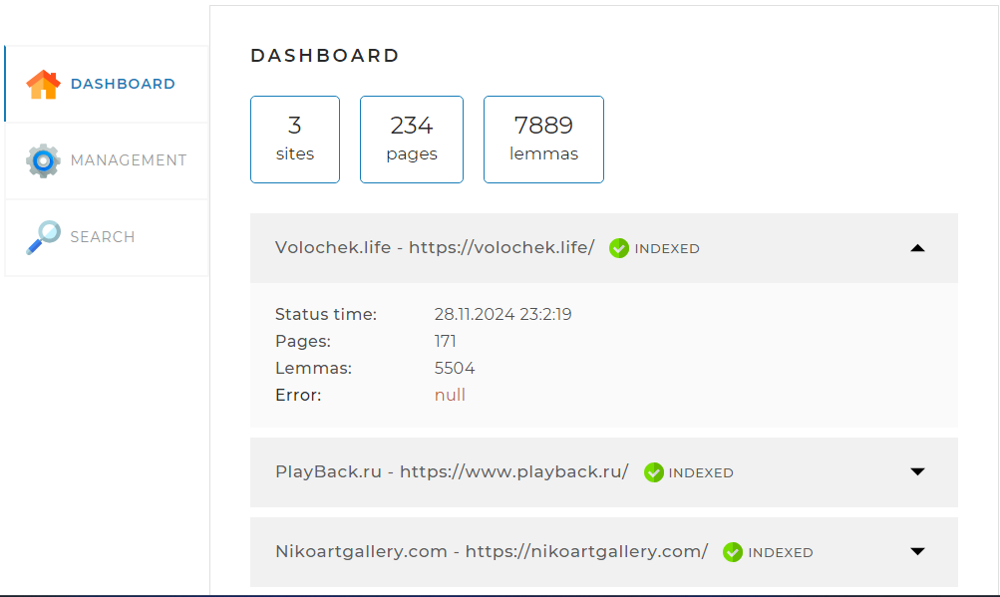

# SearchEngine. Итоговый проект по курсу «Java-разработчик»

<u><strong>Описание проекта:</strong></u>

В данном проекте, реализован поисковый движок, который помогает посетителям сайта быстро находить информацию, используя поле поиска.
Поисковый движок представляет собой Spring-приложение, работающее с локально установленной базой данных MySQL, имеющее простой веб-интерфейс и API,
через который им можно управлять и получать результаты поисковой выдачи по запросу.

<u><strong>Принципы работы поискового движка:</strong></u>

1. В конфигурационном файле перед запуском приложения заданы адреса сайтов, по которым движок осуществляет поиск.
2. Поисковый движок самостоятельно обходит все страницы заданных в конфигурации сайтов и индексирует их так, чтобы потом находить наиболее релевантные
   страницы по любому поисковому запросу.
3. Пользователь присылает запрос(набор слов, по которым нужно найти страницы сайта) через API движка.
4. Запрос определённым образом трансформируется в список слов, переведённых в базовую форму. Например, для существительных — именительный падеж, единственное число.
5. В индексе ищутся страницы, на которых встречаются все эти слова.
6. Результаты поиска ранжируются, сортируются и выдаются пользователю.

<u><strong>Стек технологий:</strong></u>

Java Core, Spring Boot, Hibernate, Apache Maven, Apache Lucene, Lombok, Jsoup 

<u><strong>Начало работы:</strong></u>

1. Установите на свой компьютер MySQL-сервер, если он ещё не установлен, и создайте в нём пустую базу данных search_engine.
В application.yaml укажите следующий путь к базе данных:
<u>jdbc:mysql://localhost:3306/search_engine?useSSL=false&requireSSL=false&allowPublicKeyRetrieval=true</u>

2. Если у вас нет возможности установить MySQL-сервер, то вы можете запустить Базу данных в контейнере Docker.
Для этого сделаете следующее:
- Установите и запустите Docker на вашем устройстве; 
- Запустите контейнер Docker, выполнив в терминале команду <u>docker-compose up</u>;
- В application.yaml укажите следующий путь к базе данных: <u>jdbc:mysql://localhost:3307/search_engine_cont?useSSL=false&requireSSL=false&allowPublicKeyRetrieval=true</u>

3. Подключите к проекту библиотеку LuceneMorphology. Для этого в директории Maven нужно создать settings.xml c указанием уникального токена доступа.

```
   <settings xmlns="http://maven.apache.org/SETTINGS/1.0.0"
   xmlns:xsi="http://www.w3.org/2001/XMLSchema-instance" xsi:schemaLocation="http://maven.apache.org/SETTINGS/1.0.0
   https://maven.apache.org/xsd/settings-1.0.0.xsd">

    <servers>
        <server>
            <id>skillbox-gitlab</id>
            <configuration>
                <httpHeaders>
                    <property>
                        <name>Private-Token</name>
                        <value>wglpat-Viu1C6oUSddYB3JdKviW
                        </value>
                    </property>
                </httpHeaders>
            </configuration>
        </server>
    </servers>
</settings>
```
- В Windows он располагается в директории
C:/Users/<Имя вашего пользователя>/.m2
- В Linux — в директории
/home/<Имя вашего пользователя>/.m2
- В macOs — по адресу
/Users/<Имя вашего пользователя>/.m2


<u><strong>Как работает поисковый движок:</strong></u>

1. В конфигурационном файле application.yaml нужно задать перечень сайтов, которые будут индексироваться.


2. После запуска проекта на http://localhost:8080/ открывается главная страница поискового движка. Изначально БД пустая и содержит только перечень сайтов,
   которые были указаны в конфигурационном файле со статусом "WAIT".


3. Что бы наполнить БД нужно запустить сервис индексации страниц. Для этого переходим во вкладку "MANAGEMENT" и нажимаем на кнопку "START INDEXING".


4. После индексации всех сайтов на главной странице мы увидим актуальную информацию, полученную в результате работы движка.



5. Так же реализована возможность индексации отдельной страницы. Для этого переходим во вкладку "MANAGEMENT" и вводим адрес в соответствующее поле.
   Если страница не входит в перечень сайтов из конфигурационного файла, то приложение вернёт соответствующую ошибку. В ином случае пойдет индексация/переиндексация указанной страницы.


6. На вкладке SEARCH реализована функция поиска страниц по ключевым словам. 
   Что бы воспользоваться поиском достаточно выбрать сайт, то которому будет осуществлён поиск и написать запрос в поле "Query".
   В результате будет выдан список страниц, подходящих под заданный запрос. В случае, если сайт не будет выбран, поиск будет осуществлён по всем сайтам.

