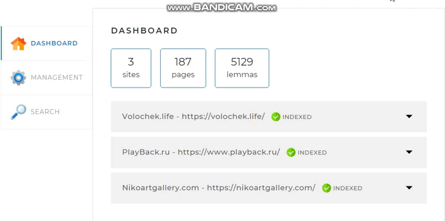

# SearchEngine. Итоговый проект по курсу «Java-разработчик PRO»

Описание проекта:

В данном проекте, реализован поисковый движок, который помогает посетителям сайта быстро находить информацию, используя поле поиска.
Поисковый движок представляет собой Spring-приложение, работающее с локально установленной базой данных MySQL, имеющее простой веб-интерфейс и API,
через который им можно управлять и получать результаты поисковой выдачи по запросу.

Принципы работы поискового движка:

1. В конфигурационном файле перед запуском приложения заданы адреса сайтов, по которым движок осуществляет поиск.
2. Поисковый движок самостоятельно обходит все страницы заданных в конфигурации сайтов и индексирует их так, чтобы потом находить наиболее релевантные
   страницы по любому поисковому запросу.
3. Пользователь присылает запрос(набор слов, по которым нужно найти страницы сайта) через API движка.
4. Запрос определённым образом трансформируется в список слов, переведённых в базовую форму. Например, для существительных — именительный падеж, единственное число.
5. В индексе ищутся страницы, на которых встречаются все эти слова.
6. Результаты поиска ранжируются, сортируются и выдаются пользователю.

Как работает поисковый движок:
1. В конфигурационном файле application.yaml нужно задать перечень сайтов, которые будут индексироваться.

2. После запуска проекта на http://localhost:8080/ открывается главная страница поискового движка. Изначально БД пустая и содержит только перечень сайтов,
   которые были указаны в конфигурационном файле со статусом "WAIT".

3. Что бы наполнить БД нужно запустить сервис индексации страниц. Для этого переходим во вкладку "MANAGEMENT" и нажимаем на кнопку "START INDEXING".

4. После индексации всех сайтов на главной странице мы увидим актуальную информацию, полученную в результате работы движка.

5. Так же реализована возможность индексации отдельной страницы. Для этого переходим во вкладку "MANAGEMENT" и вводим адрес в соответствующее поле.
   Если страница не входит в перечень сайтов из конфигурационного файла, то приложение вернёт соответствующую ошибку. В ином случае пойдет индексация/переиндексация указанной страницы.

6. 